# System Architecture Diagrams

## High-Level Architecture

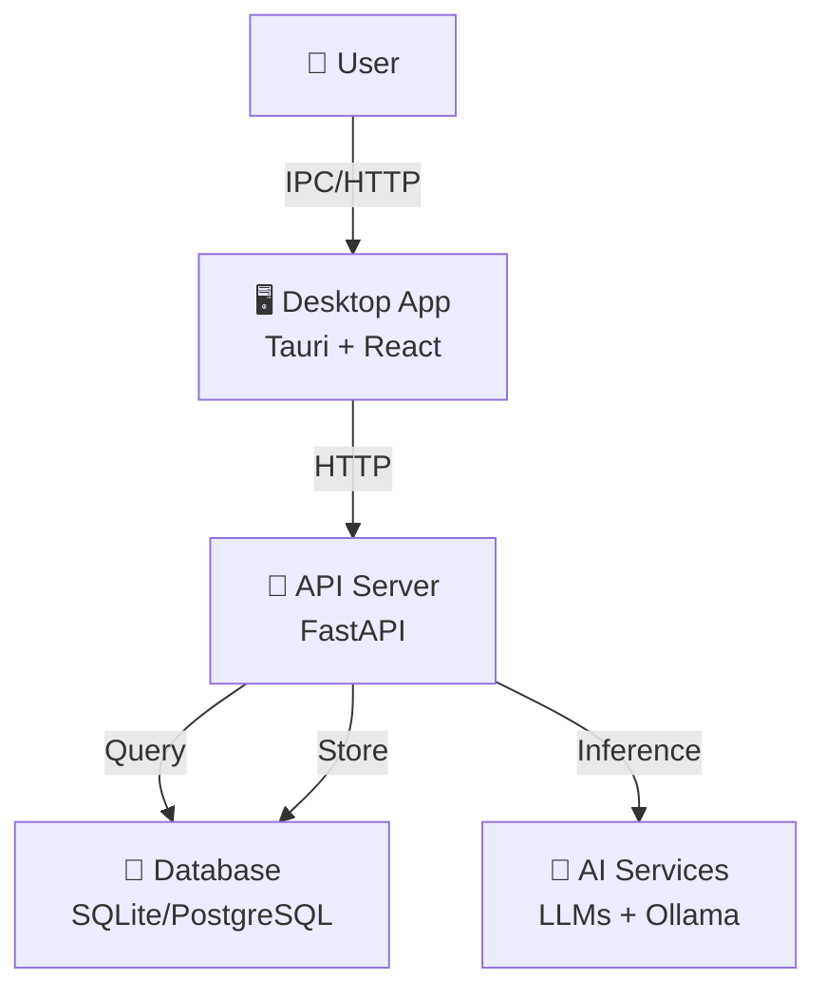

## Authentication Flow

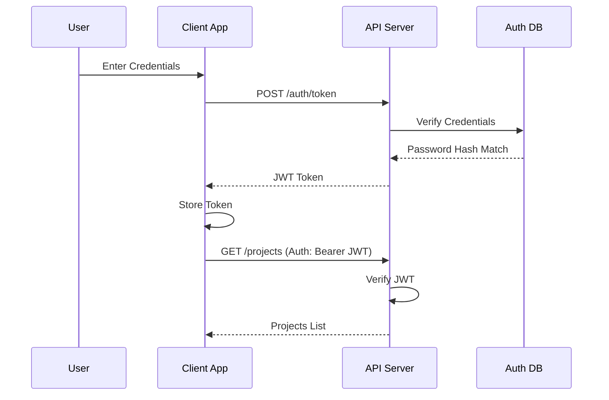

## Data Processing Pipeline

```mermaid
graph LR
    Input["Raw Data"] -->|Upload| Storage["Storage"]
    Storage -->|Load| Profile["Profile AI"]
    Profile -->|Analysis| Quality["Quality Check"]
    Quality -->|Suggestions| Clean["Cleaning AI"]
    Clean -->|Transform| Processed["Clean Data"]
    Processed -->|Store| DB["Database"]
    DB -->|Query| Analysis["Analysis"]
    Analysis -->|Recommend| Viz["Visualization AI"]
    Viz -->|Display| Dashboard["Dashboard"]
```

## Component Interaction Diagram

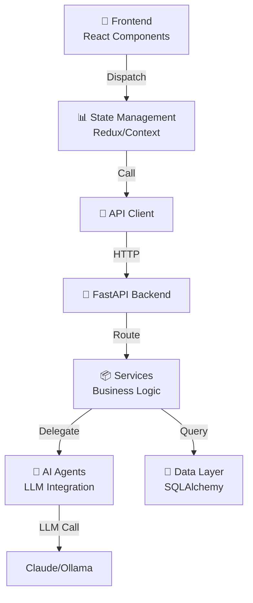

## Deployment Architecture

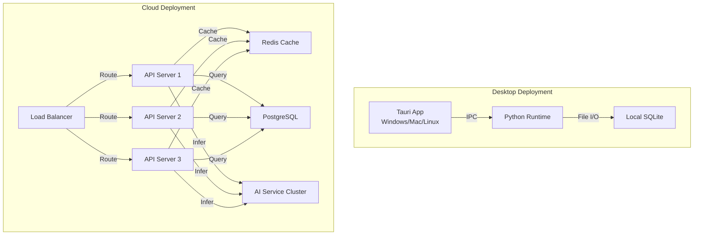

## User Role Access Control

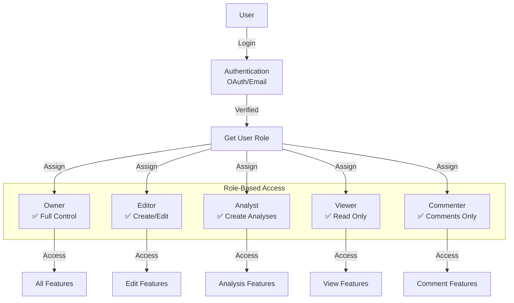

## AI Agent Architecture

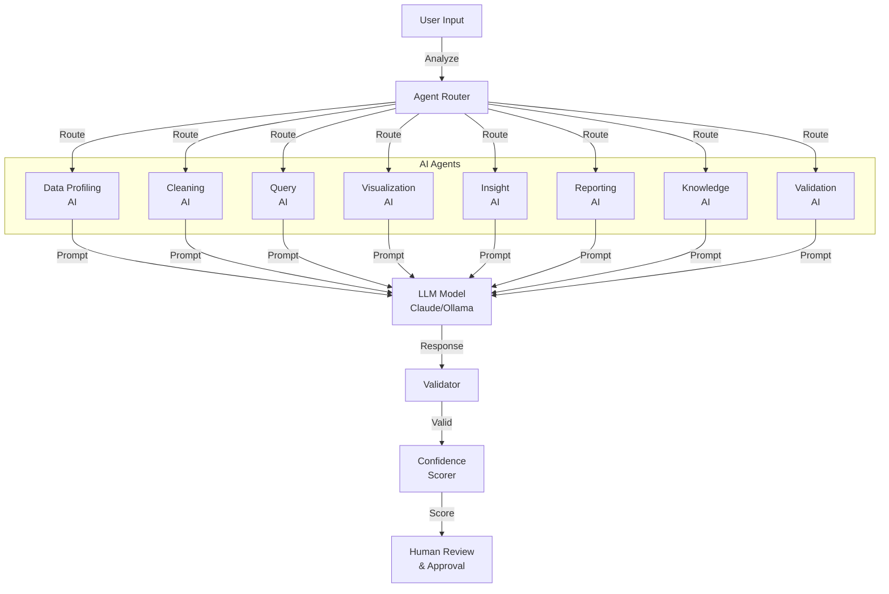

## Data Flow for Analysis

```mermaid
graph LR
    User["User"] -->|"1. Ask Question"| NLQuery["Natural Language<br/>Query Input"]
    NLQuery -->|"2. Process"| QueryAI["Query AI<br/>Agent"]
    QueryAI -->|"3. Generate"| SQL["Generated<br/>SQL"]
    SQL -->|"4. Execute"| DB["Database"]
    DB -->|"5. Results"| Parser["Result<br/>Parser"]
    Parser -->|"6. Recommend"| VizAI["Visualization<br/>AI"]
    VizAI -->|"7. Display"| Viz["Interactive<br/>Visualization"]
    Viz -->|"8. Analyze"| InsightAI["Insight<br/>AI"]
    InsightAI -->|"9. Generate"| Insights["Business<br/>Insights"]
    Insights -->|"10. Display"| Dashboard["Dashboard<br/>Widget"]
```

## Deployment Pipeline

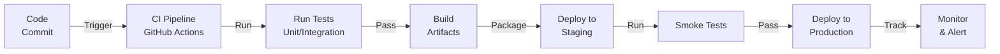

## Security Layers

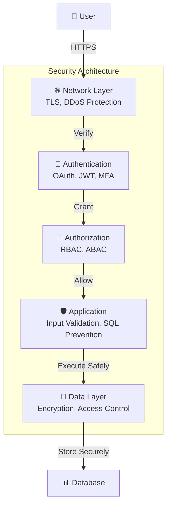

## Workflow: Creating an Analysis

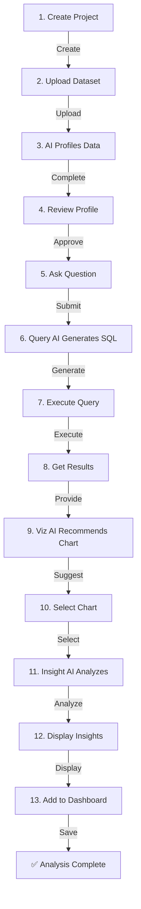

## Database Schema Relationships

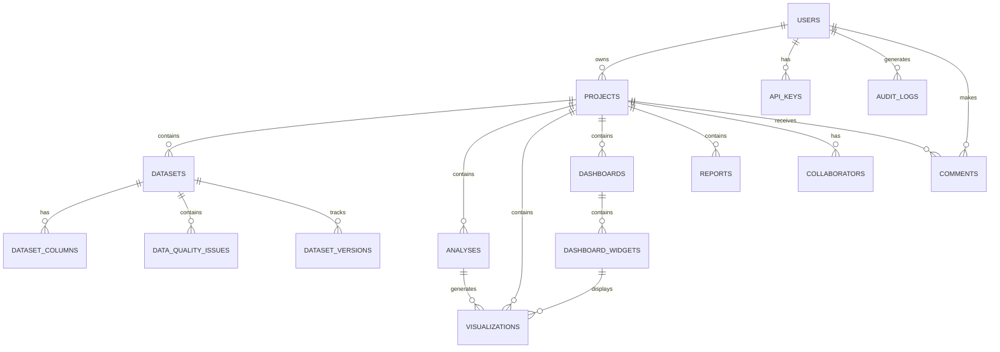

## Feature Adoption Timeline

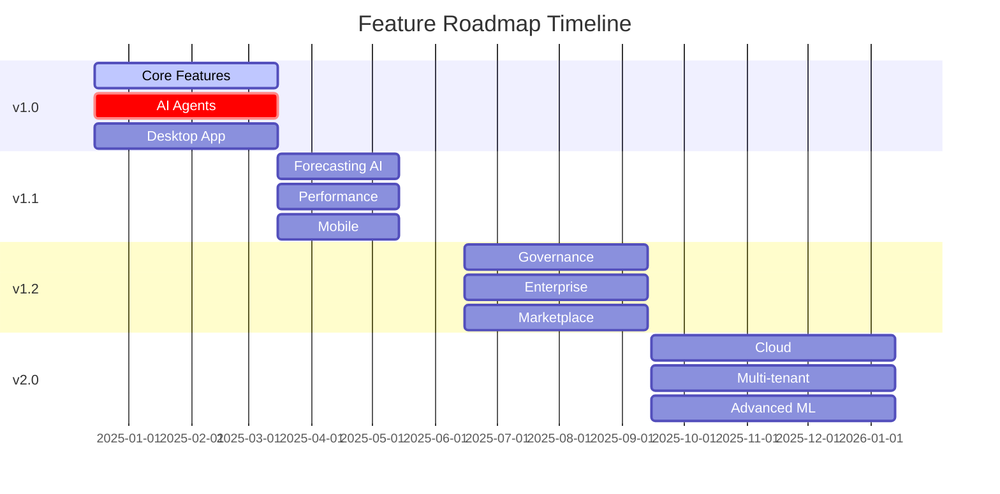

---

**Last Updated**: December 2024
